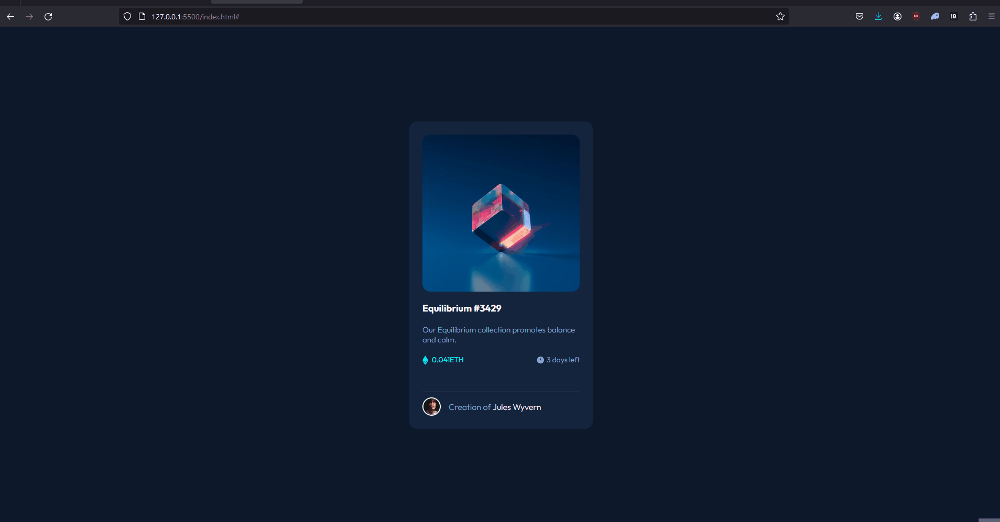

# ⚡ Challenge Frontend Mentor - NFT Preview Card Component

## 📝 Descrição do Projeto
Criar um layout próximo desse desafio do frontend mentor: [Frontend Mentor | NFT preview card component](https://www.frontendmentor.io/challenges/nft-preview-card-component-SbdUL_w0U). Onde o principal desafio é construir uma página que permita a visualização de um card NFT.
Um projeto para testar o conhecimento de HTML e, principalmente, CSS. Permitindo que seja responsivo, ou seja, funcione tanto para o desktop quanto para mobile.

Criar hovers para os elementos interativos.

Acesse o projeto criado aqui: [NFT preview card component](https://cezarviana.github.io/challenge-frontend-mentor-nft-preview-card-component/).

## 🔎 Funcionalidades
- Responsivo para todos os dispositivos
- Hovers para os elementos interativos
- Construção do HTML e CSS


## 🛠️ Ferramentas utilizadas
- **HTML:** Estruturação do projeto
- **CSS:** Estilização do projeto, responsivo, inserção de elementos interativos
- **Git:** Ferramenta de versionamento


## 🎨 Imagens do projeto


### Imagens do Design a ser seguido
<div align="center">
 <br>

 <br>


</div>


### Imagens do Design criado
<div align="center">

 <br>

 <br>


</div>


## 💡 Decisões do projeto
1. **Fontes**
- [Outfit - Google Fonts](https://fonts.google.com/specimen/Outfit?query=outfit)

2. **Cores**
```
--main-bg: hsl(217, 54%, 11%);
--card-bg: hsl(216, 50%, 16%);
--line: hsl(215, 32%, 27%);

--title-color: hsl(0, 0%, 100%);
--text-color:  hsl(215, 51%, 70%);
--eth-text-color: hsl(178, 100%, 50%);
```


## 💦 Dificuldades do projeto
- Fazer a sobreposição de imagem através do CSS, como uma marca d'água.


## 🔓 O que eu aprendi
- Aprendi a fazer o hover com sobreposição de background e imagem para sobrepor a imagem original, quando o cursor do mouse passa por cima.
- Adicionar uma imagem no HTML, via CSS.


<div align="center">

</div>

Abaixo parte do código, do aprendizado:

```
.card .image-link::before{
    content: '';
    background-color: var(--eth-text-color);
    width: 100%;
    height: 100%;
    position: absolute;
    opacity: 0;
    transition: 0.3s ease-in;
    border-radius: 15px;
}

.card .image-link::after {
    content: '';
    background: url(../images/icon-view.svg) no-repeat center;
    position: absolute;
    width: 100%;
    height: 100%;
    opacity: 0;
    transition: 0.3s ease-in;
}

.card .image-link:hover::before {
    opacity: 0.4;
}

.card .image-link:hover::after {
    opacity: 1;
}
```


## 💭 Possíveis atualizações futuras
- Finalizar o README ✅


## 🚀 Como rodar o projeto
Siga os passos abaixo para executar o projeto na sua máquina:

### Pré requisitos

- <strong><i>Git</i></strong>: Para clonar o repositório.


1. Abra o git, e execute os seguintes comandos
2. **Clonar o repositório:**
   ```bash
   git clone https://github.com/cezarviana/challenge-frontend-mentor-nft-preview-card-component.git
   ```
3. npm install
4. npm run dev
5. **Abrir o arquivo index.html:** Abra o arquivo `index.html` em um navegador web.