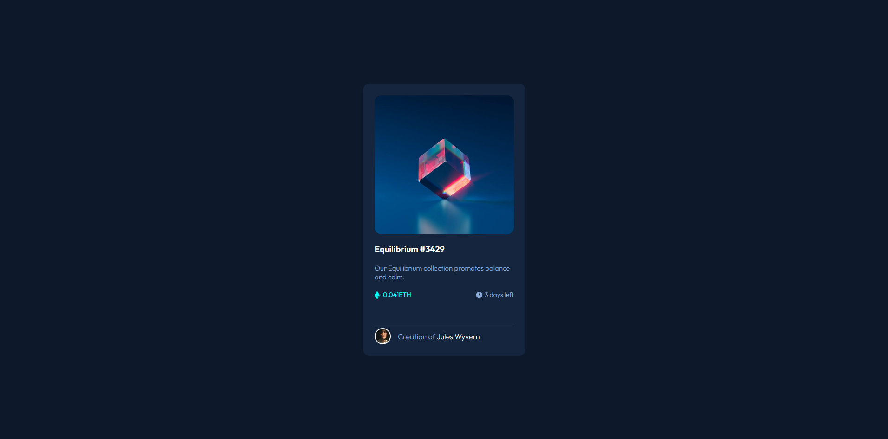
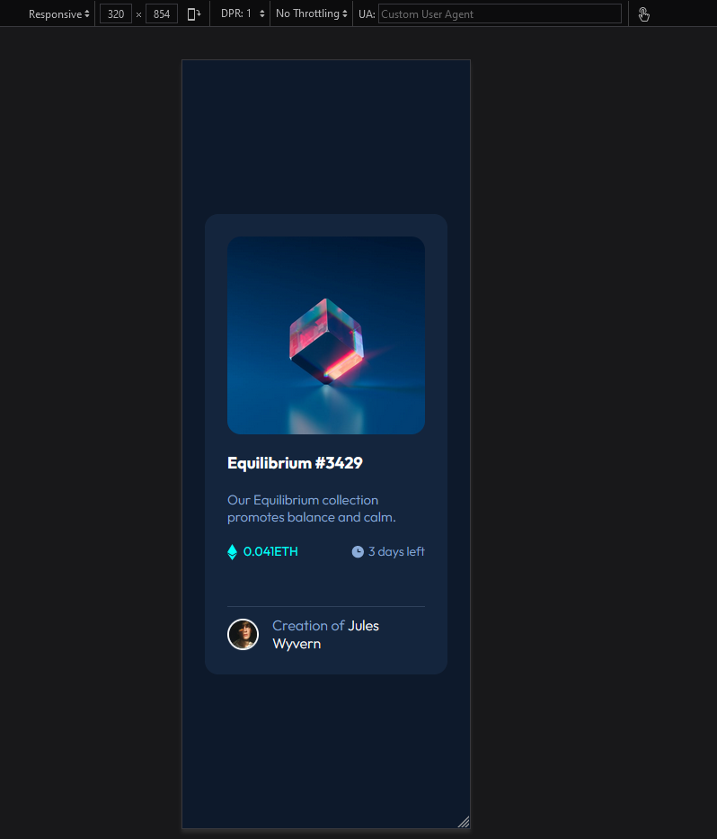
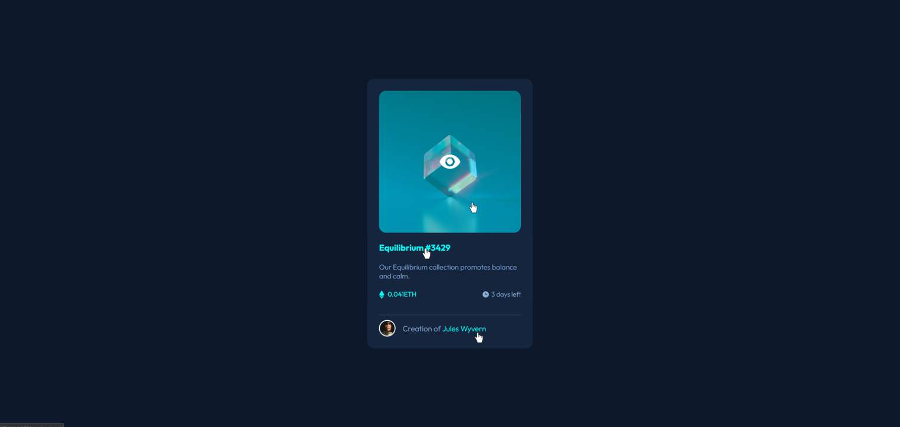

# Challenge - Frontend Mentor = NFT Preview Card Component

Um projeto para testar o conhecimento de HTML e, principalmente, CSS.

## Descrição da tarefa

- Criar um layout responsivo seguindo os padrões do desafio frontend mentor: [Frontend Mentor | NFT preview card component](https://www.frontendmentor.io/challenges/nft-preview-card-component-SbdUL_w0U). Onde o principal desafio é construir uma página que permita a visualização de um card NFT.

- Criar hovers para os elementos interativos.

### Font family para ser usada no projeto:

- Family: [Outfit - Google Fonts](https://fonts.google.com/specimen/Outfit?query=outfit)
- Weight: 800

### Cores
***
--main-bg: hsl(217, 54%, 11%);  
--card-bg: hsl(216, 50%, 16%);  
--line: hsl(215, 32%, 27%);  

--title-color: hsl(0, 0%, 100%);  
--text-color:  hsl(215, 51%, 70%);  
--eth-text-color: hsl(178, 100%, 50%);
***

### Imagens do Design a ser seguido

  

  

## Imagens do Design criado

  

  

## Tecnologias utilizadas
- HTML
- CSS
- Git Bash

### Como utilizar

1 - Clone o projeto
***
git clone <https://github.com/cezarviana/challenge-frontend-mentor-nft-preview-card-component.git>
***

## O que eu aprendi?

Aprendi a fazer o hover com sobreposição de background e imagem para sobrepor a imagem original, quando o cursor do mouse passa por cima. Além de adicionar uma imagem no HTML, via CSS.

Abaixo parte do código, do aprendizado.

***
.card .image-link::before{
    content: '';
    background-color: var(--eth-text-color);
    width: 100%;
    height: 100%;
    position: absolute;
    opacity: 0;
    transition: 0.3s ease-in;
    border-radius: 15px;
}

.card .image-link::after {
    content: '';
    background: url(../images/icon-view.svg) no-repeat center;
    position: absolute;
    width: 100%;
    height: 100%;
    opacity: 0;
    transition: 0.3s ease-in;
}

.card .image-link:hover::before {
    opacity: 0.4;
}

.card .image-link:hover::after {
    opacity: 1;
}
***